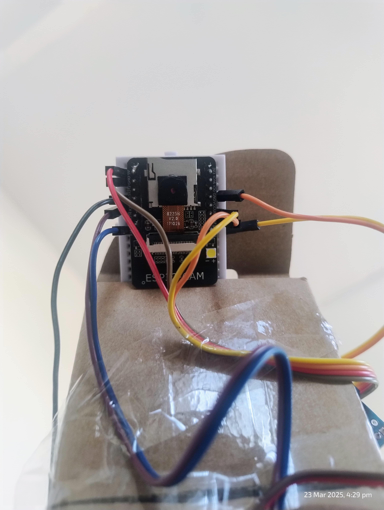
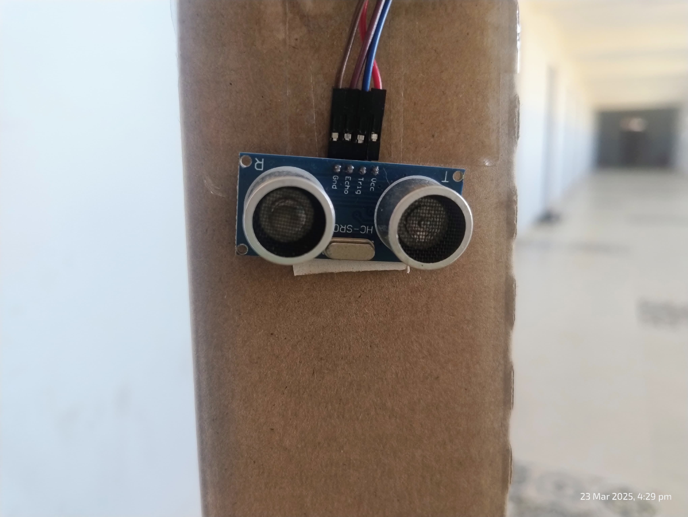
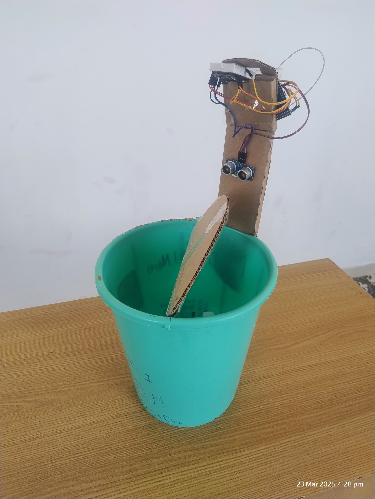
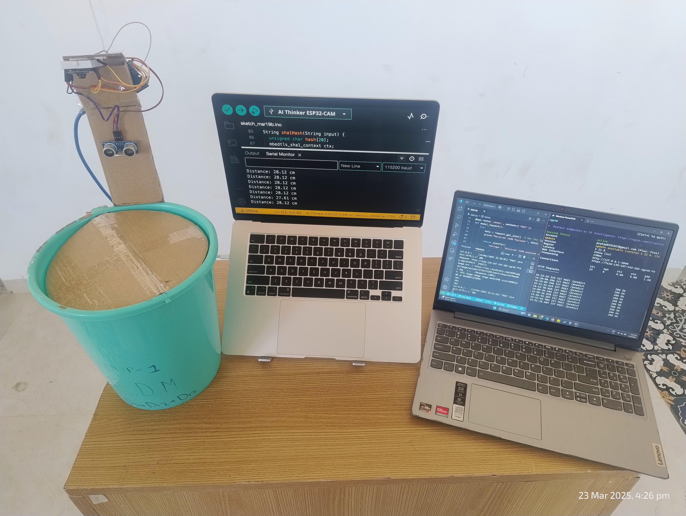

#  Smart Dustbin with AI-based Trash Classification

https://github.com/user-attachments/assets/9ea51b42-0177-48b0-9dc0-e2acd7e7d470


A smart, automated dustbin system that uses computer vision to classify trash as **biodegradable** or **non-biodegradable**, and sorts it into the correct bin using a servo-controlled mechanism. Built using an **ESP32-CAM**, **ultrasonic sensor**, and a **ViT (Vision Transformer)** model deployed on a custom backend server.

---

## Overview

This project aims to tackle improper waste disposal by leveraging AI and embedded systems. It works in the following way:

1. A user places trash on the tray.
2. An **ultrasonic sensor** detects the presence of trash.
3. The **ESP32-CAM** captures an image of the trash.
4. The image is uploaded to **Cloudinary**.
5. A custom **server** fetches the image, performs **ViT-based classification**, and sends the result back.
6. A **9g servo motor** sorts the trash into the correct bin based on the classification.

---

##  Hardware Components

| Component         | Description                            |
|------------------|----------------------------------------|
| ESP32-CAM         | Microcontroller with onboard camera    |
| Ultrasonic Sensor | Detects presence of hand/trash         |
| 9g Servo Motor    | Moves flap or gate to left/right bin   |
| Tray              | Surface to place trash                 |
| Power Supply      | 5V source for ESP32 and sensors        |

---
<!-- Scrollable image gallery -->
<div style="display: flex; overflow-x: auto; gap: 10px;">
  
  
  
  
</div>

##  AI Model

- **Model Type:** ViT (Vision Transformer)
- **Purpose:** Classify images into:
  - `Biodegradable`
  - `Non-Biodegradable`
- **Hosted On:** Custom backend server
- **Frameworks:** PyTorch

---

## Control Flow

```mermaid
graph TD
A[Trash Placed on Tray] --> B[Ultrasonic Sensor Detects Trash]
B --> C[ESP32-CAM Clicks Image]
C --> D[Upload Image to Cloudinary]
D --> E[Backend Server Fetches Image]
E --> F[Run Inference using ViT Model]
F --> G[Send Classification Result to ESP32]
G --> H[Servo Motor Sorts Trash to Left/Right Bin]
'''

